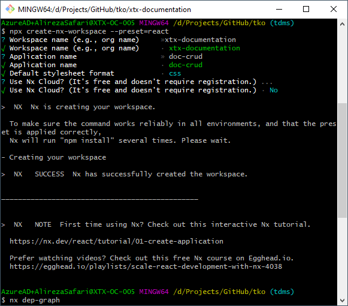
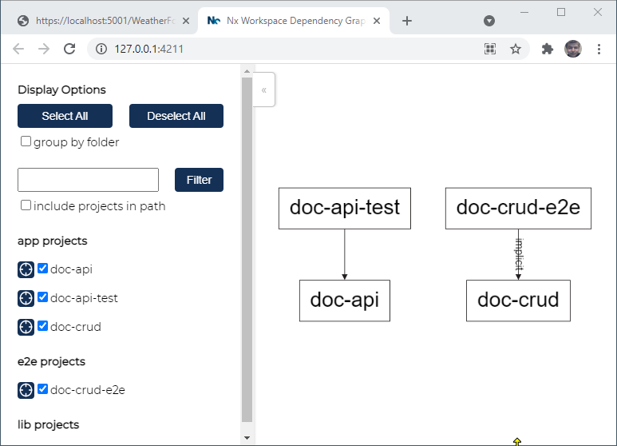
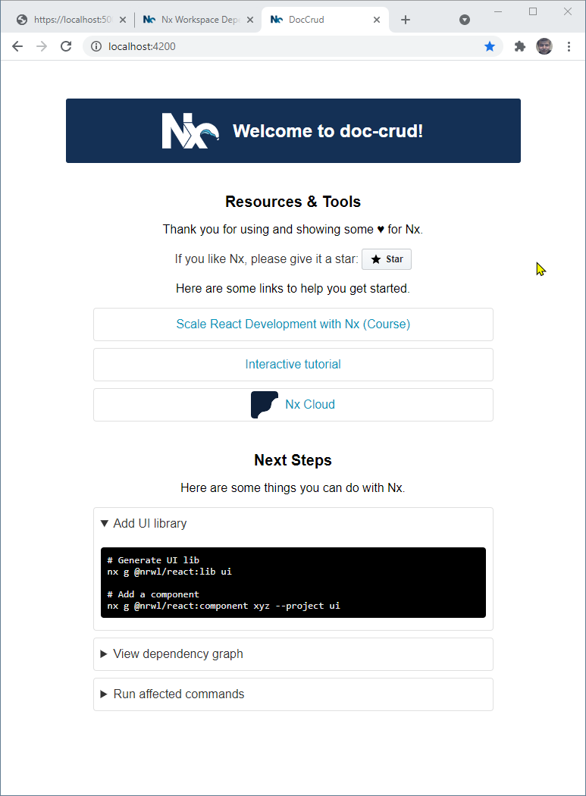

**Kaizen Documentation Platform (KDP)**

Kaizen Documentation Platform KDP, is where the team gain/share
improvements, knowledge and skills.

The generated Nx workspace will be covering a DotNet Api and a React.TS
App equipped with Redux and Syncfusion Controls.

🔎 Nx is a set of Extensible Dev Tools for Monorepos.

# Contents {#contents .TOC-Heading}

[Step 1. Setup nx workspace preset for React Typescript
1](#step-1.-setup-nx-workspace-preset-for-react-typescript)

[Step 2. Add DotNet WebApi to the nx workspace
1](#step-2.-add-dotnet-webapi-to-the-nx-workspace)

# Step 1. Setup nx workspace preset for React Typescript

npx create-nx-workspace --preset=react

{width="4.645833333333333in"
height="4.078099300087489in"}

Figure 1

# Step 2. Add DotNet WebApi to the nx workspace

For adding .NET capabilities to our workspace, we use NxDotNet plugin
within our generated workspace directory:

nx g \@nx-dotnet/core:app doc-api \--template=webapi \--language=c#

for the name of template, enter *webapi*; as for this project we want to
make an API in dotnet core (see Figure 2).

{width="5.0in" height="5.232358923884514in"}

Figure 2

After you run the command **nx run doc-api:serve** you can visit the
generated template in the browser at
<https://localhost:5001/WeatherForecast>

{width="6.260416666666667in"
height="1.4820898950131234in"}

Figure 3

Now if you run the dependency graph command you should see the graph
below:

nx dep-graph

{width="3.8281255468066493in"
height="2.7633825459317585in"}

Figure 4

to see the generated app first run ***nx serve doc-app*** and then visit
<http://localhost:4200/> to see the created app in your browser:

## 
